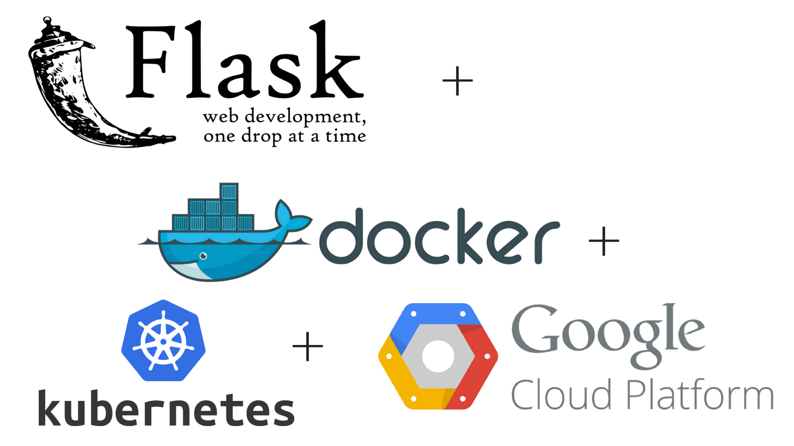

### IDS 721 Final Project



ML Modeling and Platform: This project uses `Pytorch` ML framework to classfiy the pictures containing food or drink. For example, the following image will be classified as drink.  

[image here]

Cloud Platform: Flask + Docker + Google Kubernetes Engine 

Testing: This project has used Locust to see the elastic scale-up performance vial load test with Locust. 

#### Flask 

This flask application classifies the image uploaded to the website using a deep learning model build on Pytorch. 

1. Download the Repository to your local machine and change your current working directory under `flask_app`.  

2. Run `python3 server2.py`

3. Then,`http://localhost:8080/` will should you the response of the webapplication without predicting anything, an welcome page.

4. To make the prediction, you have to provide an url link to your image. For example,

   `http://localhost:8080/predict?url=https://yelpmodel0907.s3.amazonaws.com/Images/images/drink.jpeg` 

   Type this to your web server will show you the prediction result for `drink.jpeg` which is stored in a S3 bucket in Amazon Web Service.  

#### Docker 

1. First, create a compute engine through the google cloud console like usual. Make sure that you have selected to allow HTTP traffice and HTTPS tranffic. 

   [image here]

2. Second, create a firewall rule for your computing instance in VPC networking section -firewall tab. This step is essensial for you to access your application deployed on cloud. The specific setting is shown below. 

   [image here]

3. Third, SSH to your virutal machine by clicking the SSH icon on the right or your VM. A terminal window for your virtual machine will pop up. In the terminal window, use the following command to remove the existing Docker, Installing the lastest Docker, and Verify the installation by viewing the `Hello from Docker!` message by running the built-in `hello-world` app in Docker. 

   ```bash
   sudo apt-get remove docker docker-engine docker.io
   sudo apt-get update 
   sudo apt-get install docker.io
   sudo docker run hello-world
   ```

   Then, hopefully, you will see `Hello from Docker!` message.  

4. Fourth, containerize your application using Docker. Please use the following command in order. 

   1. Clone the git repot to your virtual machine. 

      ```bash
      git clone https://github.com/Reficulx/yelp
      ```

   2. Change the working directory to `yelpcloud`, and use the following command to build a containerized application, run the container, and test the result. 

      ```bash 
      sudo docker build -t yelpcloud-app:latest .
      sudo docker run -d -p 8080:8080 yelpcloud-app
      sudo docker ps -a # check the status of the docker container
      curl -X GET "http://localhost:8080/predict?url=https://yelpmodel0907.s3.amazonaws.com/Images/images/drink.jpeg"
      ```

      The output should be like something shown below in the picture. And we could see that our model correctly predicts the picture. You could use any picture with the url you want to do the testing. 

      [image here]

   3. Upload Your Docker image for the application to the Docker Hub using the following command. You have to register an account first in Docker Hub website before you could do this. 

      ```bash
      sudo docker images # use this command to see your image id
      sudo docker tag <your image id> <your docker hub id>/<app name> 
      sudo docker push <your docker hub id>/<app name> 
      ```

#### Kubernetes

1. Create a Kubernetes cluster through the Google Cloud Console using the default setting and connect to the cluster usign the `connect` button. Then a terminal for that cluster will pop up. 

   [image here]

2. Create a deployment for your containerized application stored in your docker hub account. 

   ```bash
   kubectl create deployment yelpcloud-app --image=<docker hub id>/<app name>
   kubectl expose deployment yelpcloud-app --type=LoadBalancer --port 80 --target-port 8080
   kubectl get service # to see whether the deployment has finished and external ip
   ```

   `kubectl get service` shows the external ip of your deployment application and you could access it through this external IP. 

3. Now we could do the test to the deployed application. The code and result are shown below. 

   [image here]

#### Locust Testing 

1. Please check the `locustfile.py` for the testing details. Include it in your current working directory in the termial windown poped up when you connect to your kubernetes cluster. 

2. Then run `locust -f locustfile.py` to do the test. The setup window is shown below. 

   [image here]

   The testing result is shown below, we obviously could observe the ealstic scale up through the following result. 

   [image here]

3. Note that, there might be an error showing up saying that:

   `System open file limit “1024” is below minimum setting 10000 and the system does not allow locust to increase this setting by itself.`

   When this pops up, use the command `Ulimit -Sn 10000` to solve this problem. 
